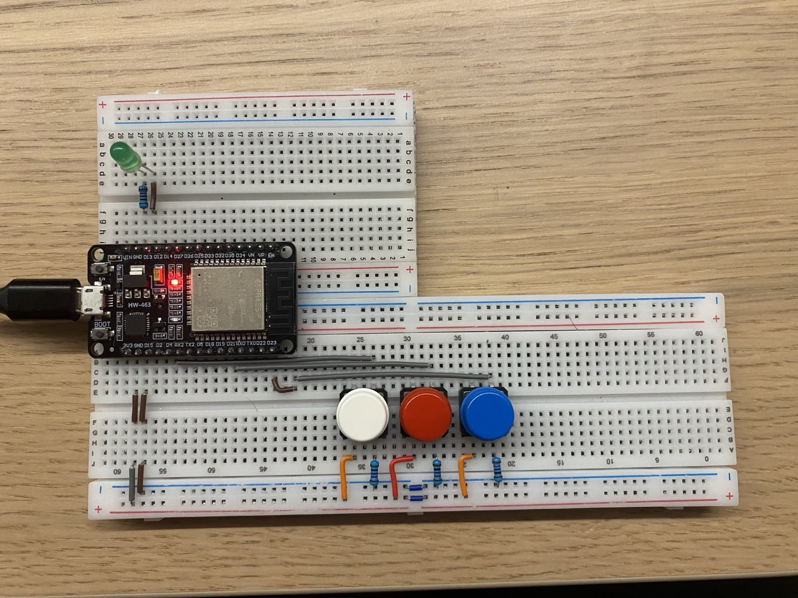

# Embedded-Rut-on-esp32-different-Blink-Mode:crab:

This is my first little Rust program for the esp32. 
## Setup:
It consists of an ESP32, 3 buttons and on LED. Each button has it's own mode:

Button 1 (white): Led lights up as long as the button is pressed

Button 2 (red): Led flashes with an delay of 500 milliseconds as long as the button is pressed

Button 3 (blue9: Led flashes in an SOS cycle. If the button is pressed once, it flashes one round 
                 of SOS. If the button remains pressed, the LED flashes for as long as the button remains pressed

### Info:
[The Rust Programming Language]: https://doc.rust-lang.org/stable/book/
[Embedded Rust(no_std) on Espressif]: https://docs.esp-rs.org/no_std-training/01_intro.html
[esp-hal]:https://docs.espressif.com/projects/rust/esp-hal/1.0.0-beta.1/esp32/esp_hal/index.html
[esp_println]: https://docs.espressif.com/projects/rust/esp-println/0.14.0/esp_println/

